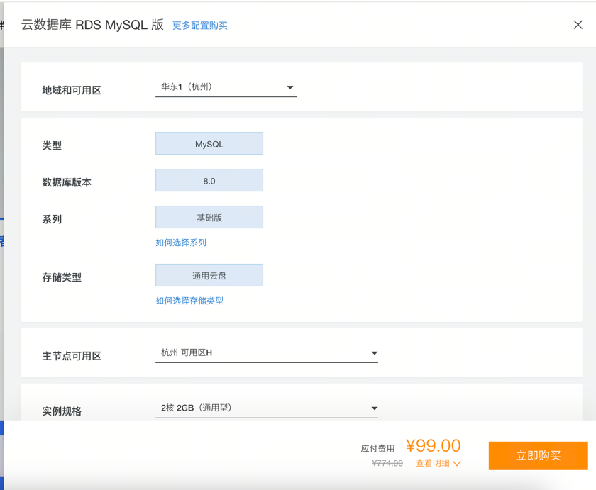

# train

## 数据库 dtd
```text
https://gitee.com/3siants/mybatis-generator
```

## 手动下载
```text
一、先到阿里云仓库对应包
https://developer.aliyun.com/mvn/search

二、解析jar包到本地仓库
mvn install:install-file -Dfile=pagehelper-spring-boot-starter-1.4.6.jar \
                         -DgroupId=com.github.pagehelper \
                         -DartifactId=pagehelper-spring-boot-starter \
                         -Dversion=1.4.6 \
                         -Dpackaging=jar


三、解析pom文件到本地仓库
mvn install:install-file -Dfile=pagehelper-spring-boot-starter-1.4.6.pom \
                         -DgroupId=com.github.pagehelper \
                         -DartifactId=pagehelper-spring-boot-starter \
                         -Dversion=1.4.6 \
                         -Dpackaging=pom


四、本地导入安装包
<dependency>
    <groupId>com.github.pagehelper</groupId>
    <artifactId>pagehelper-spring-boot-starter</artifactId>
    <version>1.4.6</version>
</dependency>

执行 mvn clean install，验证依赖加载是否成功
```

## 云数据库
