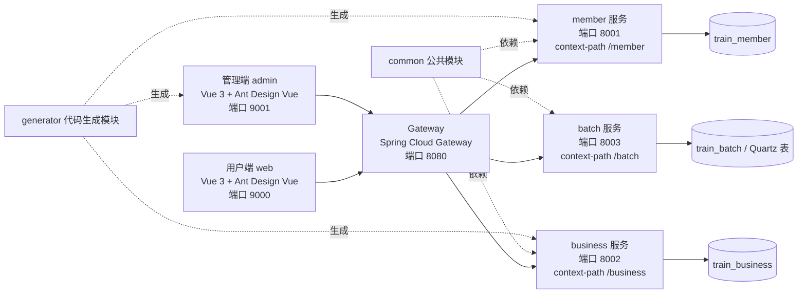
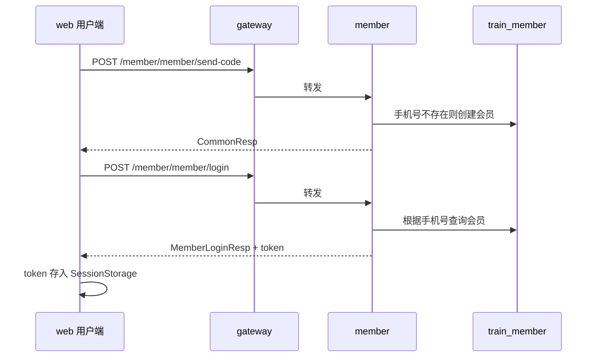
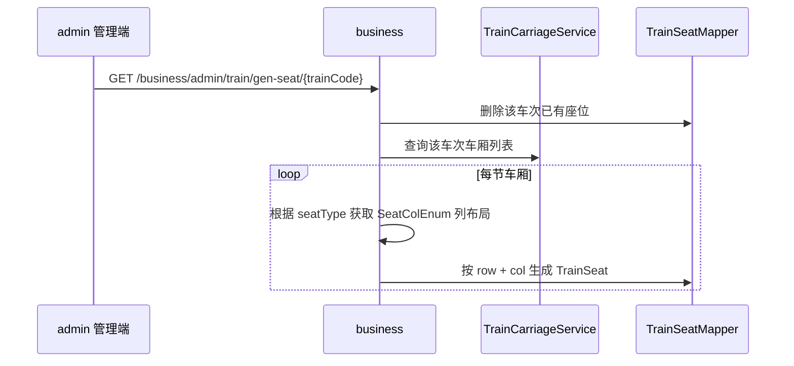

# Train 项目架构梳理

## 1. 项目定位

`train` 是一个火车票业务练习项目，整体采用“Spring Boot 微服务后端 + Spring Cloud Gateway 网关 + Vue 3 前端”的结构。后端以 Maven 多模块组织，前端分为用户端 `web` 和管理端 `admin` 两个独立 Vue 应用。

当前代码主体已经实现了会员登录、乘车人管理、基础车次数据管理、每日车次数据管理、座位生成、Quartz 定时任务管理等能力。前端中还预留了余票、下单、订单、票务、秒杀令牌等页面和接口调用，但对应的部分后端实现未在当前仓库代码中完整出现。

## 2. 总体架构



后端请求统一从 `gateway` 进入，网关根据路径前缀转发：

| 路径 | 目标服务 | 本地端口 |
| --- | --- | --- |
| `/member/**` | `member` | `8001` |
| `/business/**` | `business` | `8002` |
| `/batch/**` | `batch` | `8003` |

前端开发环境通过 `VUE_APP_SERVER` 指向网关：

| 应用 | 目录 | 开发端口 | 后端地址 |
| --- | --- | --- | --- |
| 用户端 | `web` | `9000` | `http://127.0.0.1:8080` |
| 管理端 | `admin` | `9001` | `http://localhost:8080` |

## 3. 后端模块

### 3.1 根 Maven 工程

根目录 `pom.xml` 是父 POM，统一管理 Java 17、Spring Boot `3.0.2`、Spring Cloud `2022.0.0-RC2` 以及 MyBatis、MySQL、PageHelper、Hutool、Fastjson、Kaptcha、Spring Cloud Alibaba 等依赖版本。

模块列表：

| 模块 | 说明 |
| --- | --- |
| `common` | 公共响应体、分页、异常、JWT、雪花 ID、日志切面、登录上下文、拦截器 |
| `gateway` | API 网关、跨域、路由转发、登录 token 校验 |
| `member` | 会员、登录、短信验证码模拟、乘车人管理 |
| `business` | 车站、车次、经停站、车厢、座位、每日车次/车厢等业务数据管理 |
| `batch` | Quartz 动态任务管理 |
| `generator` | MyBatis Generator 与 Freemarker 代码生成工具 |

### 3.2 common 公共模块

`common` 被 `member`、`business`、`batch` 依赖，承担跨服务复用能力。

核心类：

| 类 | 职责 |
| --- | --- |
| `CommonResp<T>` | 统一接口返回结构：`success`、`message`、`content` |
| `PageReq` / `PageResp<T>` | 分页请求与分页响应 |
| `BusinessException` / `BusinessExceptionEnum` | 业务异常与错误枚举 |
| `ControllerExceptionHandler` | 全局异常处理 |
| `LogAspect` | Controller 层请求参数、返回值、耗时日志 |
| `LogInterceptor` | 请求链路日志上下文 |
| `MemberInterceptor` | 从请求头 `token` 解析登录会员信息 |
| `LoginMemberContext` | 使用 `ThreadLocal` 保存当前登录会员 |
| `JwtUtil` | JWT 创建与解析 |
| `SnowUtil` | 雪花 ID 生成 |

典型返回格式：

```json
{
  "success": true,
  "message": null,
  "content": {}
}
```

### 3.3 gateway 网关模块

入口类：`com.ankers.gateway.config.GatewayApplication`

主要职责：

- 监听 `8080`。
- 将 `/member/**`、`/business/**`、`/batch/**` 转发到对应服务。
- 配置全局 CORS。
- 通过 `LoginMemberFilter` 做统一 token 校验。

`LoginMemberFilter` 的放行路径包括：

- 包含 `/admin` 的管理端接口
- `/redis`
- `/hello`
- `/member/member/login`
- `/member/member/send-code`
- `/business/kaptcha`

其余请求需要请求头带 `token`，并通过 `JwtUtil.validate(token)` 校验。校验失败时直接返回 `401 Unauthorized`。

注意：由于 `member` 服务设置了 `server.servlet.context-path=/member`，网关路径 `/member/member/login` 实际对应服务内 Controller 的 `/member/login`。

### 3.4 member 会员模块

入口类：`com.ankers.member.config.MemberApplication`

服务配置：

- 端口：`8001`
- context-path：`/member`
- Mapper 扫描：`com.ankers.member.mapper`
- MyBatis XML：`classpath:/mapper/**/*.xml`

核心数据表/领域对象：

| Domain | 说明 |
| --- | --- |
| `Member` | 会员账号，当前以手机号为核心标识 |
| `Passenger` | 乘车人，归属于登录会员 |

主要接口：

| Controller | 路径 | 说明 |
| --- | --- | --- |
| `MemberController` | `/member/send-code` | 模拟发送短信验证码，验证码固定为 `8888` |
| `MemberController` | `/member/login` | 手机号 + 验证码登录，返回 JWT |
| `MemberController` | `/member/register` | 注册会员 |
| `MemberController` | `/member/count` | 统计会员数量 |
| `PassengerController` | `/passenger/save` | 新增/修改乘车人 |
| `PassengerController` | `/passenger/query-list` | 分页查询乘车人 |
| `PassengerController` | `/passenger/delete/{id}` | 删除乘车人 |

登录链路：



登录后的用户端请求由 axios 自动把 `store.state.member.token` 写入请求头 `token`。

### 3.5 business 业务模块

入口类：`com.ankers.business.config.BusinessApplication`

服务配置：

- 端口：`8002`
- context-path：`/business`
- Mapper 扫描：`com.ankers.business.mapper`
- MyBatis XML：`classpath:/mapper/**/*.xml`

当前后端已实现的领域对象：

| Domain | 说明 |
| --- | --- |
| `Station` | 车站基础信息 |
| `Train` | 车次基础信息 |
| `TrainStation` | 车次经停站 |
| `TrainCarriage` | 车次车厢 |
| `TrainSeat` | 车次座位 |
| `DailyTrain` | 每日车次 |
| `DailyTrainCarriage` | 每日车厢 |

当前后端已实现的管理接口均位于 `/admin/**` 下，主要是 CRUD 和分页查询：

| Controller | 路径前缀 | 说明 |
| --- | --- | --- |
| `StationAdminController` | `/admin/station` | 车站管理 |
| `TrainAdminController` | `/admin/train` | 车次管理、查询全部车次、生成座位 |
| `TrainStationAdminController` | `/admin/train-station` | 经停站管理 |
| `TrainCarriageAdminController` | `/admin/train-carriage` | 车厢管理 |
| `TrainSeatAdminController` | `/admin/train-seat` | 座位管理 |
| `DailyTrainAdminController` | `/admin/daily-train` | 每日车次管理 |
| `DailyTrainCarriageAdminController` | `/admin/daily-train-carriage` | 每日车厢管理 |

座位生成链路：



业务约束主要在 Service 层实现，例如：

- `StationService` 校验站名唯一。
- `TrainService` 校验车次编号唯一。
- `TrainStationService` 校验同车次站序、站名唯一。
- `TrainCarriageService` 校验同车次厢号唯一。
- `TrainSeatService#genTrainSeat` 使用事务重新生成座位。

`business/pom.xml` 中已引入 OpenFeign、LoadBalancer、Redis、Sentinel、Sentinel Nacos datasource、Kaptcha 等依赖，但当前源码中主要还是基础数据 CRUD，尚未看到完整的余票、订单、Redis 缓存、Sentinel 规则、Feign 调用等实现。

### 3.6 batch 定时任务模块

入口类：`com.ankers.batch.config.BatchApplication`

服务配置：

- 端口：`8003`
- context-path：`/batch`
- 使用 Spring Boot Quartz。
- `SchedulerFactoryBean` 绑定项目数据源，使 Quartz 任务可持久化。
- `MyJobFactory` 让 Quartz Job 支持 Spring Bean 自动注入。

主要接口：`JobController`，路径前缀 `/admin/job`。

| 接口 | 说明 |
| --- | --- |
| `/run` | 手动触发任务 |
| `/add` | 新增 Cron 任务 |
| `/pause` | 暂停任务 |
| `/resume` | 恢复任务 |
| `/reschedule` | 修改 Cron 表达式 |
| `/delete` | 删除任务 |
| `/query` | 查询所有任务及状态 |

示例任务：

- `TestJob` 实现 Quartz `Job`，并使用 `@DisallowConcurrentExecution` 禁止同一任务并发执行。
- `SpringBootTestJob` 和静态 `QuartzConfig` 当前处于注释状态。

### 3.7 generator 代码生成模块

`generator` 用于从数据库表生成后端 CRUD 代码和部分前端页面。

包含两条生成链路：

1. MyBatis Generator
   - 由 `generator/pom.xml` 中的 `mybatis-generator-maven-plugin` 驱动。
   - 当前配置指向 `src/main/resources/generator-config-business.xml`。
   - 用于生成 `domain`、`Example`、`Mapper`、`mapper XML`。

2. Freemarker 自定义生成器
   - `ServerGenerator` 读取 generator config 中的表配置和数据库元数据。
   - 模板位于 `generator/src/main/java/com/ankers/generator/ftl/`。
   - 可生成 `service`、`controller/admin`、`req`、`resp`，并预留生成 Vue 页面能力。
   - `EnumGenerator` 可把 Java 枚举导出为前端 `enums.js`。

## 4. 前端模块

### 4.1 web 用户端

目录：`web`

技术栈：

- Vue 3
- Vue Router 4
- Vuex 4
- Ant Design Vue 3
- Axios

核心结构：

| 文件/目录 | 说明 |
| --- | --- |
| `src/main.js` | 注册 Ant Design Vue、全局图标、axios 拦截器 |
| `src/router/index.js` | 用户端路由和登录拦截 |
| `src/store/index.js` | 保存会员登录信息到 SessionStorage |
| `public/js/session-storage.js` | SessionStorage 工具 |
| `views/login.vue` | 登录页 |
| `views/main/passenger.vue` | 乘车人管理 |
| `views/main/ticket.vue` | 余票查询页面 |
| `views/main/order.vue` | 下单页面 |
| `views/main/my-ticket.vue` | 我的车票页面 |

用户端路由中 `/` 下的页面带 `meta.loginRequire=true`，如果 Vuex 中没有 `member.token`，会跳转到 `/login`。

axios 请求拦截器会自动加：

```text
token: <当前登录会员 token>
```

### 4.2 admin 管理端

目录：`admin`

技术栈与用户端基本一致，多了 `pinyin-pro` 依赖，用于管理端部分组件中的拼音处理。

主要页面：

| 路由 | 页面 | 说明 |
| --- | --- | --- |
| `/base/station` | `station.vue` | 车站管理 |
| `/base/train` | `train.vue` | 车次管理、生成座位 |
| `/base/train-station` | `train-station.vue` | 经停站管理 |
| `/base/train-carriage` | `train-carriage.vue` | 车厢管理 |
| `/base/train-seat` | `train-seat.vue` | 座位管理 |
| `/business/daily-train` | `daily-train.vue` | 每日车次管理 |
| `/business/daily-train-station` | `daily-train-station.vue` | 每日经停站页面 |
| `/business/daily-train-carriage` | `daily-train-carriage.vue` | 每日车厢页面 |
| `/business/daily-train-seat` | `daily-train-seat.vue` | 每日座位页面 |
| `/batch/job` | `job.vue` | Quartz 任务管理 |

注意：管理端还包含 `sk-token`、`confirm-order`、`daily-train-ticket`、`member/ticket` 等页面和接口调用，但当前后端源码中没有匹配的 Controller/Service 实现。

## 5. 数据访问模式

后端整体使用 MyBatis Generator 风格：

```text
Controller -> Service -> Mapper -> mapper XML -> MySQL
```

每个业务实体通常包含：

| 层 | 示例 |
| --- | --- |
| Domain | `Train.java` |
| Example 条件类 | `TrainExample.java` |
| Mapper 接口 | `TrainMapper.java` |
| Mapper XML | `mapper/TrainMapper.xml` |
| SaveReq | `TrainSaveReq.java` |
| QueryReq | `TrainQueryReq.java` |
| QueryResp | `TrainQueryResp.java` |
| Service | `TrainService.java` |
| Controller | `TrainAdminController.java` |

分页统一使用 PageHelper：

```java
PageHelper.startPage(req.getPage(), req.getSize());
List<Train> list = trainMapper.selectByExample(example);
PageInfo<Train> pageInfo = new PageInfo<>(list);
```

新增数据的 ID 使用 `SnowUtil.getSnowflakeNextId()` 生成。

## 6. 鉴权与登录态

鉴权分两层：

1. 网关层
   - `gateway` 的 `LoginMemberFilter` 对非白名单接口校验 token。
   - token 缺失或无效返回 `401`。

2. 服务层
   - `member` 的 `SpringMvcConfig` 注册 `MemberInterceptor`。
   - `MemberInterceptor` 从请求头读取 token，解析成 `MemberLoginResp`，写入 `LoginMemberContext`。
   - 业务代码可通过 `LoginMemberContext.getId()` 获取当前会员 ID。

用户端前端在登录成功后把会员信息写入 SessionStorage，之后所有 axios 请求自动携带 token。管理端接口由于路径包含 `/admin`，在网关层被放行，当前没有独立的管理端登录鉴权。

## 7. 本地运行方式

后端建议按依赖顺序启动：

```bash
mvn clean install
mvn -pl gateway spring-boot:run
mvn -pl member spring-boot:run
mvn -pl business spring-boot:run
mvn -pl batch spring-boot:run
```

前端：

```bash
cd web
npm run dev

cd ../admin
npm run dev
```

常用本地地址：

| 服务 | 地址 |
| --- | --- |
| 网关 | `http://localhost:8080` |
| 用户端 | `http://localhost:9000` |
| 管理端 | `http://localhost:9001` |
| member | `http://localhost:8001/member` |
| business | `http://localhost:8002/business` |
| batch | `http://localhost:8003/batch` |

`http/` 目录下保存了若干 `.http` 文件，可用于接口联调。

## 8. 当前实现状态与注意点

1. 配置文件中直接写了数据库连接信息，后续如果要进入共享环境或生产环境，建议改为环境变量、配置中心或本地私有配置文件。

2. `gateway` 的管理端放行规则是 `path.contains("/admin")`，粒度较粗。当前管理端没有单独登录体系，适合开发练习，不适合直接暴露到公网。

3. `LoginMemberContext` 使用 `ThreadLocal` 保存登录用户，但当前 `MemberInterceptor` 未在请求结束后显式 `remove`。在 Web 容器线程复用场景下，建议补充 `afterCompletion` 清理逻辑。

4. 用户端和管理端的部分页面已经调用了票务、订单、秒杀相关接口，例如 `/business/confirm-order/do`、`/business/daily-train-ticket/query-list`、`/member/ticket/query-list`，但当前后端代码未包含这些 Controller/Service/Domain，说明仓库处于课程/迭代中间态。

5. `business` 已引入 Redis、Sentinel、OpenFeign 等依赖，但当前可见业务代码尚未系统使用这些能力。

6. 多数 CRUD 代码来自生成器，结构一致，适合继续用 `generator` 扩展新表；手写逻辑主要集中在唯一性校验、登录、座位生成、Quartz 调度等位置。

7. `common` 中日志切面会打印请求参数和返回结果，当前敏感字段排除列表为空。涉及手机号、身份证、token、密码等字段时，建议补充脱敏或排除。

## 9. 适合继续演进的方向

- 补齐票务核心后端：每日座位、每日余票、订单确认、我的车票、候补/排队等。
- 给管理端增加独立鉴权，收紧网关白名单。
- 把数据库密码、生产地址等配置迁移到环境变量或配置中心。
- 完善 Redis 缓存、分布式锁、Sentinel 限流和令牌机制。
- 为座位生成、登录、乘车人归属、Quartz 动态任务增加单元测试或集成测试。
- 清理前端中已经存在但后端未实现的页面入口，或按页面补齐 API。
